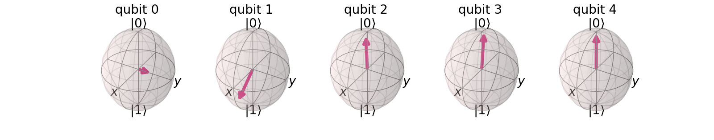
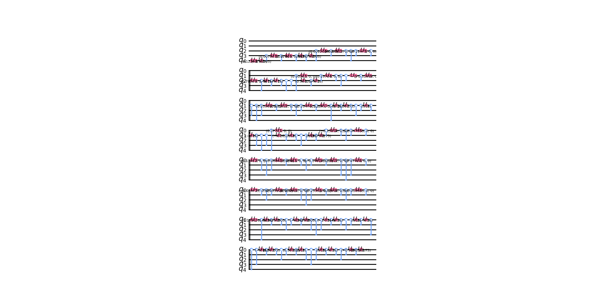

# Qiskit-Hackathon

## Title 
- Quantum image dataset loading

### Description
- This project converts given image dataset to quantum processable data(qubits) by utilizing PCA for dimensionality reduction and initial states for generating qubits. It can analyze the number of PCA components and produce the transformed qubits of an image dataset for a chosen IBM quantum device or simulator. The variance percentage that is being kept by PCA is also given as feedback to the user.

### Link to Issue
[Issue 44](https://github.com/qiskit-community/qiskit-camp-africa-19/issues/44)

### Requirements:
You need to have the following installed on your system
* [python version 3.6+](https://www.python.org/downloads/)
* [git](https://git-scm.com/downloads)

### Installation
- Git clone the repo
```bash
git clone https://github.com/moswil/Qiskit-Hackathon
```
- Change directory to `Qiskit-Hackathon`, I will refer to this directory as `project-root-directory` from now
```bash
cd Qiskit-Hackathon
```
- Run the following command to have project set up
- Create virtual environment
```bash
python -m venv qiskit-env
```
- For `Linux or Mac Users` activate it as below
```bash
source qiskit-env/bin/activate
```
- For `Windows Users`, activate it as follows
```bash
qiskit-env\\Scripts\\activate.bat
```
- Install the project dependencies
```bash
pip install -r requirements.txt
```

### Local or Online?
1. Online
    - If you want to Experiment the `IBM Q Experience`, you need to create an account on [IBM Quantum Computing](https://quantum-computing.ibm.com/)
    - Then go to settings and copy your token
    - Create a file name as `.env` in your `project-root-directory`
    - In the `.env file` create a key-value pair as shown below
    ```
    TOKEN='your-token`
    ```
    - Replace `'your-token'` with the actual account token
    - Just run the code on the next section
2. Offline / Local
    - Just follow the next section

### Update the `main.py` file
- Change the `DIR` variable to the directory that contains your images
- Then run  
```bash
python main.py
```

### Output
#### Original Image (Classical data)


#### Quantified Image (Quantum Data)
- bloch


- circuit


### Steps: 
- Image preprocessing
    - Image reading
    - Image resizing (cropping)
    - normalization
    - dimensionality reduction (PCA)
- Quantum Encoding
    - done in [q_circuit.py](https://github.com/moswil/Qiskit-Hackathon/blob/master/quantum_data.py)

